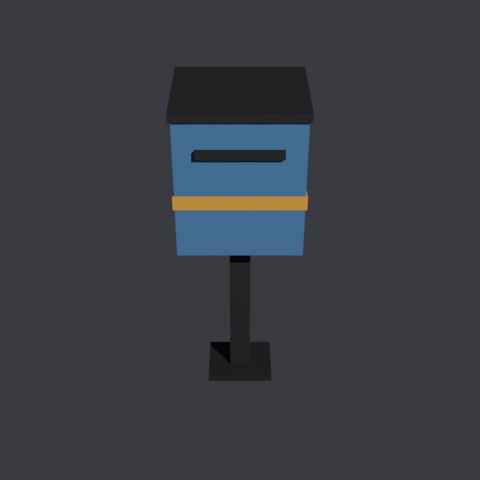

# blender-forge

**Assets-as-code for stylized low-poly game art.** Describe a 3D asset as a
small, deterministic Python recipe; `bforge` drives a headless Blender to
build it, validate it, render review previews, and export a Godot-ready GLB —
no `.blend` files to track, no Blender GUI session, fully reproducible from a
seed. Designed to pair with an AI coding agent (e.g. Claude Code): the agent
writes the recipe, reads the JSON result and the preview renders, and
iterates.



*The prop above is [`examples/recipes/mailbox.py`](examples/recipes/mailbox.py):
84 triangles, one palette material, an auto-generated Godot collider — built,
validated, previewed and exported by one `bforge` command each.*

## Why

- **Reproducible**: an asset is ~80 lines of commented Python in git, not an
  opaque binary. Rebuilding with the same seed yields the same GLB; tweaking
  a `PARAMS` value is a normal code-review-able diff.
- **Agent-friendly**: every command prints a machine-readable JSON result
  (validation stats, artifact paths, full tracebacks) as the last stdout
  line; preview renders give a vision-capable agent eyes on the result.
  A ready-made [agent skill](#agent-skill-text-to-game-ready-model) teaches
  the whole workflow.
- **Godot-correct by construction**: the GLB export preset mirrors what Godot
  itself passes to Blender when importing `.blend` files; collider/navmesh
  hints use Godot's name-suffix conventions; extensions Godot silently drops
  (Draco, meshopt, GPU instancing) are explicitly disabled.
- **Headless and dependency-free**: works on a machine with no display; the
  CLI is stdlib-only Python, the in-Blender library needs nothing beyond
  `bpy`/`bmesh`. Verified against Blender 5.2 LTS (EEVEE and Cycles both
  render fine in `--background` — no xvfb needed).

## Agent skill: text to game-ready model

[`skills/blender-assets/`](skills/blender-assets/SKILL.md) turns an AI
coding agent into a text-to-3D-asset pipeline — through *code*, not a
neural mesh generator. Ask for "a low-poly park bench, ~1.6 m, two-tone
wood" and the agent writes a recipe, builds it with `bforge`, looks at the
preview renders, and iterates until both the validator and its own eyes are
satisfied. Compared to neural text-to-3D you get clean topology, exact
real-world dimensions, an auto-generated collider, an editable parametric
source in git — and no generated-content licensing questions.

Install for Claude Code by symlinking into your personal skills directory:

```bash
ln -s /path/to/blender-forge/skills/blender-assets ~/.claude/skills/blender-assets
```

The skill bundles reference sheets (bmesh patterns, Godot conventions, the
palette workflow, a recipe cookbook); any agent framework that can read
Markdown and run shell commands can use the same files as plain
documentation.

## Quick start

```bash
git clone <this repo> blender-forge && cd blender-forge
uv sync
export BLENDER_PATH=/path/to/blender    # or put blender on PATH
uv run bforge doctor                    # environment check
uv run bforge build examples/recipes/mailbox.py
uv run bforge preview examples/recipes/mailbox.py
```

`build` prints (last line of stdout, human logs go to stderr):

```json
{"status": "ok", "artifacts": [".../assets/generated/mailbox.glb"], "previews": [],
 "validation": {"tris": 84, "budget": 300, "materials": 1, "manifold": true,
                "uv_ok": true, "transforms_applied": true, "names_ascii": true,
                "warnings": [], "errors": [], "ok": true},
 "blender_stderr_tail": "", "error": null, "duration_sec": 0.6}
```

To use `bforge` from other projects, install it as a tool:
`uv tool install --editable /path/to/blender-forge`.

## Architecture

```
bforge (system Python, stdlib only)        forge (Blender's bundled Python)
  src/bforge/cli.py     - argparse CLI       src/forge/session.py   - scene reset, Context
  src/bforge/runner.py  - spawns blender      src/forge/lowpoly.py   - bmesh primitives/helpers
  src/bforge/config.py  - blender/forge.toml  src/forge/palette.py   - palette-atlas PNG + material
                                               src/forge/material.py  - canonical Principled materials
runner_entry.py (repo root)                   src/forge/export.py    - Godot-flavoured GLB export
  - runs INSIDE blender --background          src/forge/validate.py  - poly budget / manifold / UV checks
  - loads a job.json, executes it,            src/forge/preview.py   - EEVEE turntable renders
  - writes a result.json
```

`bforge` never imports `bpy`. It shells out to:

```
<blender> --background --factory-startup --python runner_entry.py -- <job.json path>
```

Blender's own stdout is noisy (version banners, addon logging, glTF
exporter progress, ...), so `runner_entry.py` never relies on it: it writes
a JSON result to a temp file that `bforge` reads back. Blender's stderr
tail is always captured and forwarded, even on failure, so problems are
diagnosable without re-running anything by hand.

`forge` never runs outside Blender: it's reached purely via
`sys.path.insert(0, <repo>/src)` inside `runner_entry.py`, and is not an
installed dependency of the `bforge` package (`bpy` is not `pip`/`uv`
installable here - it lives inside the Blender executable).

## Requirements

- Blender **>= 4.2** (LTS recommended; built and tested against
  **5.2.0 LTS**). Set `$BLENDER_PATH`, add `[blender] path = "..."`
  to `forge.toml`, or just have `blender` on `PATH`.
- Python **>= 3.12** for the `bforge` CLI itself (this is a *different*
  Python from Blender's bundled one - `bforge` runs under your system/uv
  Python and never imports `bpy`).
- [`uv`](https://docs.astral.sh/uv/) to manage the virtualenv.
- No network access and no third-party dependencies are required anywhere
  in this toolkit.

## Configuration: `forge.toml`

Lives in a **consuming project** (e.g. a game repo), not in blender-forge
itself. `bforge` searches for it starting at the current working directory
and walking **upward, stopping at (and including) the enclosing git
repository's root** - so a `forge.toml` above your git root is intentionally
never picked up, and a plain non-git directory falls back to searching all
the way to the filesystem root.

```toml
[blender]
path = "/path/to/blender"        # optional; see resolution order below

[project]
recipes_dir = "assets/recipes"   # default if omitted
output_dir = "assets/generated"  # default if omitted
previews_dir = "assets/previews" # default if omitted

[defaults]
poly_budget = 300                # merged under each recipe's own PARAMS
palette = ["#3E4147", "#E8E4DA", "#F2B233"]   # project-wide color palette
```

**Blender binary resolution order:** `$BLENDER_PATH` env var -> `forge.toml`
`[blender].path` -> `blender` on `PATH`. First match wins.

## Commands

Every command prints **exactly one JSON object as the last line of
stdout** (see Quick start for the shape). All human-readable progress goes
to **stderr**, so `stdout | tail -n1 | jq` (or equivalent) always gets you
the machine-readable result. Inside `validation`, `warnings` never block;
`errors` do; `ok` is `true` iff `errors` is empty.

Process **exit code is 0 only when** `status == "ok"` **and** (`validation`
is absent/`null`, or `validation.errors` is empty). A successful build with
only warnings still exits 0.

For `doctor`, the same `validation` slot carries environment diagnostics
instead of asset validation (`blender_version`, `python_version`, `checks`,
`ok`) - reusing the one slot keeps every command's output shape identical.

### `bforge doctor`

Checks: Blender found and executable, version >= 4.2, a real headless
render (tiny EEVEE frame) and a real glTF export both succeed inside a
throwaway scene. Deliberately implemented with raw bpy/bmesh calls (no
dependency on the `forge` library), so it stays a pure "does Blender itself
work" probe, independent of the asset library's own correctness.

```bash
uv run bforge doctor
```

### `bforge new <name> [--force]`

Copies `templates/recipe.py` into `<recipes_dir>/<name>.py` (pure
filesystem operation, does not touch Blender).

### `bforge build <recipe>... [--all] [--seed N] [--timeout S]`

Builds one or more recipes: runs `build(ctx)`, validates the result, and -
only if validation has no blocking errors - exports
`<output_dir>/<recipe>.glb`. Building a *single* recipe prints its result
JSON verbatim. Building several (explicit list or `--all`) prints one
aggregated JSON: `artifacts`/`previews` are the union across recipes,
`validation` becomes `{"<recipe name>": {...}, ...}`, and `status` is
`"ok"` only if every recipe succeeded.

```bash
uv run bforge build parcel_box
uv run bforge build --all --seed 1
```

### `bforge preview <recipe> [--angles N] [--size WxH] [--seed N]`

Builds the recipe (in-memory, no GLB written) and renders `N` (default 4)
EEVEE turntable angles into `<previews_dir>/<recipe>/angle_<i>.png`, evenly
spaced in azimuth at a fixed ~30 deg elevation, framed to the asset's
bounding box. A simple sun + flat world background is added automatically -
this is a review tool, not a beauty render. Objects carrying a Godot
"removed at import" suffix (`-colonly`, `-convcolonly`, `-occonly`,
`-navmesh`, `-noimp`) are hidden from previews, exactly as Godot would drop
them - so an unmaterialed collider box never covers the actual asset.

```bash
uv run bforge preview parcel_box --angles 4 --size 640x480
```

### `bforge run <script.py> [--seed N]`

Escape hatch: executes an arbitrary Python file inside headless Blender
(scene already reset, a `ctx` global available exactly like in
`build(ctx)`) under the same JSON contract. Any exception aborts with
`status="error"` and the **full traceback** in `error`; a script can record
outputs via `ctx.add_artifact(path)` / `ctx.add_preview(path)`.

```bash
uv run bforge run scripts/inspect_scene.py
```

### `bforge validate <path.glb | recipe>`

Validates an existing GLB (re-imported into a clean scene) or a recipe
(built in-memory, not exported) against the same rules `build` uses. Useful
for checking a hand-authored `.glb` without going through a recipe.

```bash
uv run bforge validate assets/generated/parcel_box.glb
uv run bforge validate parcel_box
```

## Recipe contract

`<recipes_dir>/<name>.py`:

```python
"""What this asset is and why it exists. Keep this up to date."""

PARAMS = {                      # every tunable value lives here, commented
    "size": 0.4,                 # metres (1 Blender unit = 1 metre in Godot)
    "palette": ["#8B5A2B", "#D2B48C", "#3A3A3A"],
    "poly_budget": 300,          # triangle budget checked by forge.validate
}

def build(ctx):                 # ctx: scene already reset, seed already set
    """Builds the asset; returns the root object or collection."""
    ...
```

`PARAMS` is merged **on top of** the project's `forge.toml [defaults]`
(`PARAMS` wins on key conflicts) into `ctx.params`. To inherit a project
default (like the palette), simply omit the key - an explicit `None` would
override the default with `None`.

`ctx` (see `src/forge/session.py`) provides:

| attribute | meaning |
|---|---|
| `ctx.seed` | the int seed for this build |
| `ctx.rng` | `random.Random(ctx.seed)` - the **only** randomness source a recipe should use |
| `ctx.params` | `PARAMS` merged over `forge.toml [defaults]` |
| `ctx.root_collection` | an empty, already-linked `bpy.types.Collection` to build into |
| `ctx.scene` | the current (already reset) `bpy.types.Scene` |
| `ctx.add_artifact(path)` / `ctx.add_preview(path)` / `ctx.warn(msg)` | for `bforge run` scripts |

Requirements (enforced by `forge.validate`, see below): determinism (no bare
`random.*`); units in metres; asset "front" = **-Y** (Godot convention);
transforms applied (`scale == 1`, `rotation == 0` - use
`forge.lowpoly.apply_transforms(obj)`); object names in ASCII; Godot suffix
conventions on collider siblings.

See `templates/recipe.py` for a fully commented starting point,
[`examples/recipes/mailbox.py`](examples/recipes/mailbox.py) for a complete
multi-part prop, and `tests/fixtures/recipes/box.py` for the minimal case.

### Godot import suffixes (`forge.export.SUFFIXES`)

| kind | suffix | meaning |
|---|---|---|
| `collision` | `-col` | trimesh (concave) static collision sibling, mesh kept |
| `collision_only` | `-colonly` | trimesh collision only, no visual mesh imported |
| `collision_convex` | `-convcol` | convex collision sibling, mesh kept |
| `collision_convex_only` | `-convcolonly` | convex collision only, no visual mesh imported |
| `occluder` / `occluder_only` | `-occ` / `-occonly` | Occluder3D (with / instead of the mesh) |
| `navmesh` | `-navmesh` | navigation mesh, source mesh removed |
| `rigid` | `-rigid` | imported as RigidBody3D |
| `no_import` | `-noimp` | excluded from import entirely |
| `vertex_color` | `-vcol` | (on a *material* name) albedo from vertex colors |

Use `forge.export.apply_suffix(name, "collision_convex_only")` rather than
hand-typing suffixes, so recipes, `forge.validate` and `forge.preview`
share one source of truth (`forge.export.is_non_visual` is what preview
uses to hide import-removed objects).

### Palette atlas vs vertex colors

The default, recommended workflow is a **palette atlas**
(`forge.palette`): a tiny `N x 1` pixel PNG, one flat color per pixel,
generated purely through `bpy.data.images` (pixel buffer + `pack()`/`save()`
- **no PIL**), sampled with nearest-neighbour (`interpolation = 'Closest'`)
so colors stay crisp at any resolution. Every face's UV points at the
center of one pixel (`forge.palette.assign_color`). This is the more robust
choice for a multi-renderer target (Godot's Forward+/Mobile/Compatibility)
because it goes through the same texture-sampling path as any other
material.

`forge.material.vertex_color_material` / `set_vertex_colors` are provided
as the alternative workflow (paint a `BYTE_COLOR`/`CORNER` color attribute,
export with `export_vertex_color='MATERIAL'`). Note that Godot's
Compatibility renderer has a known sRGB-darkening nuance with vertex
colors - prefer the palette atlas unless you have a specific reason, and if
you do use vertex colors, verify visually in all three Godot renderers.

## Validation rules (`forge.validate.validate_collection`)

**Blocking errors** (build fails, GLB is not exported, exit code != 0):

- triangle count (evaluated depsgraph, `calc_loop_triangles`) over budget
- an object with an un-applied transform (`scale != 1` or `rotation != 0`)
- a degenerate face (zero area)
- UV coordinates outside `[0, 1]` on an object using an image-textured
  (palette) material
- a non-ASCII object or collection name

**Warnings only** (reported, never fail the build):

- **non-manifold edges** - deliberately *not* an error: open meshes (signs,
  foliage cards, ramps) are legitimate low-poly geometry, and - as observed
  while building this toolkit - a perfectly solid, manifold cube reliably
  comes back **non-manifold after a glTF export/re-import round-trip**,
  because UV seams split shared vertices at every face boundary (each
  triangle corner becomes its own vertex once UVs diverge across an edge).
  Treating that as an error would make `bforge validate <exported.glb>` fail
  on virtually every UV-mapped asset, so this check is informational.
- more than `max_materials` (default 2) materials used
- overall bounding box bigger than 10 m or smaller than 1 cm (a likely, but
  not certain, unit mistake)

## Scale: `unit_settings.scale_length` has no effect on glTF export

Verified by direct experiment (export a 2 m cube with `scale_length = 1.0`
and `= 0.01`; the GLB's `POSITION` accessor bounds are byte-identical in
both cases). The glTF exporter always treats **1 Blender unit = 1 metre**,
independent of the scene's display/measurement unit settings -
`scale_length` only affects how numbers are *labelled* in Blender's UI
(e.g. "cm" vs "m"), not the actual export scale. This is why
`forge.session.reset_scene()` still explicitly sets `scale_length = 1.0`
(for authoring clarity / consistent viewport numbers) but recipes do not
need to worry about it being silently reinterpreted at export time.

## A background-mode nuance

`bpy.context.view_layer.objects` is **not** guaranteed to reflect an object
just linked via `collection.objects.link(obj)` when running headless
(`--background`) without an interactive event loop - it can still report
the object as absent immediately after linking it. `forge.export` and
`forge.lowpoly.join()` therefore check "is this object already linked"
via the live `Object.users_collection` / `Collection.all_objects` API
instead of `view_layer.objects`, which does not suffer from this staleness.
If you write new headless bpy code, prefer `bpy.data`/`Collection`-level
membership checks over `view_layer.objects` for anything happening in the
same frame as a `.link()` call.

## Testing

```bash
uv run pytest                          # unit tests only run automatically;
                                        # blender-marked tests skip if no binary is found
BLENDER_PATH=/path/to/blender uv run pytest -m blender   # force the real integration suite
BLENDER_PATH=/path/to/blender uv run pytest              # everything
```

- `tests/test_config.py`, `tests/test_cli.py`, `tests/test_runner.py`: unit
  tests, no Blender involved (`forge.toml`/git-root resolution, `$BLENDER_PATH`
  priority, argv parsing, JSON-contract assembly against a monkeypatched
  `subprocess.run`).
- `tests/test_integration_blender.py` (`@pytest.mark.blender`): spawns a
  real headless Blender for every command, including a GLB export -> clean
  scene re-import round trip and a 4-angle preview render.

## Design notes

- `doctor`'s diagnostics reuse the `validation` JSON slot rather than a new
  top-level field, keeping every command's result shape identical.
- `join()` in `forge.lowpoly` is one of the few places that uses
  `bpy.ops.object.join()` (under `context.temp_override()`) instead of pure
  `bmesh`/`bpy.data`: there is no simple, robust data-only way to merge
  multiple objects' material slots/indices. Everything else in `forge`
  prefers the data API, which is far more reliable in `--background`.
- The GLB export preset (`forge.export.GODOT_GLTF_EXPORT_SETTINGS`) mirrors
  the options Godot 4.7 itself passes to Blender when importing `.blend`
  files, with compression/instancing extensions Godot does not read
  (`Draco`, `meshopt`, `gltfpack`, `EXT_mesh_gpu_instancing`) explicitly
  disabled - Godot ignores unknown `extensionsUsed` silently, so enabling
  them would lose data without any error.

## License

MIT - see [LICENSE](LICENSE).
